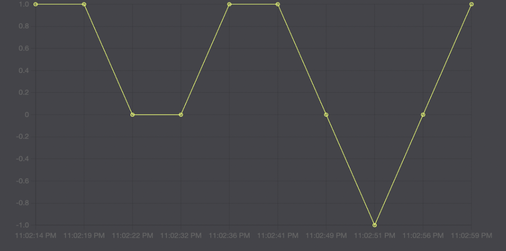
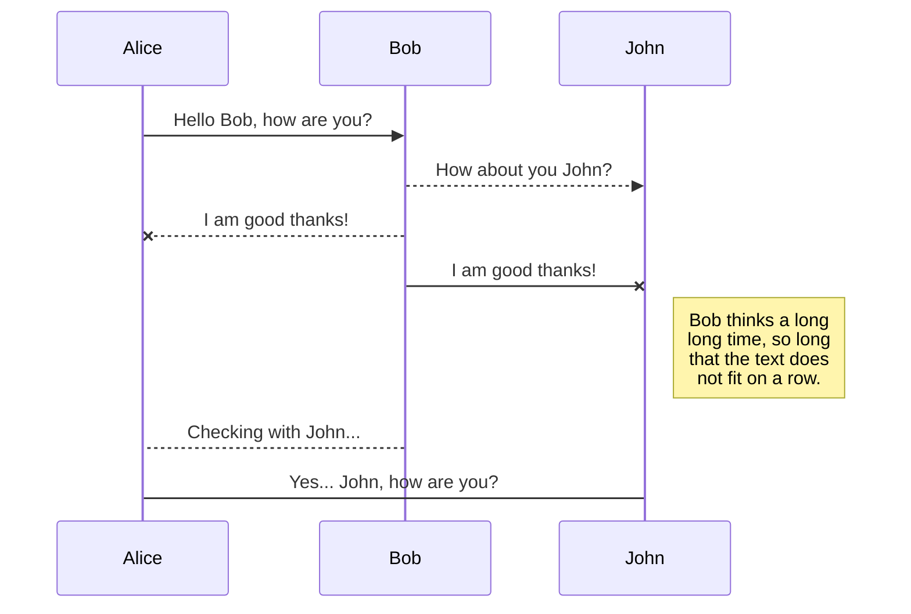
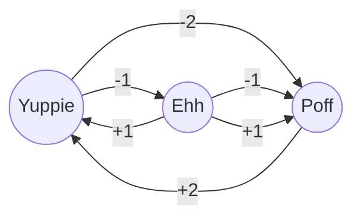

# Yuppie - Poff

It is an application that includes graphical and locational filtering of the text field shares that users write with the `Yuppie`, `Ehh` and `Poff` buttons they choose according to their emotional state.

## Technology 

1. HTML
2. CSS
3. JavaScript
	i. EChart.js
5. PHP
	ii. phpMyAdmin

## Pages

1. Homepage 
2. Login
	1. User Login
	2. Admin Login 
3. Sign Up
4. Profile
5. About
6. Privacy Policy

### Homepage;

#### Chart

#### Three Buttons, Text Area and Submit Button  :

` Yuppie : 😄 ` ` Ehh : 😐 ` ` Poff : 😕 `   
What do you think?  
>> | `You can write up to 255 characters...` |

`Submit`
### Usage

1. `Emoji` : The user will choose an emoji suitable for their mood. 

2. `Text` : The user will write their thoughts in the text field.

3. `Submit` : The user will share his/her emotional state with the submit button. 

4. `Chart` : The emojis he chose in his post; 

	i. The first one `😄`, will have an instant upward effect on the chart with a value of +1.   
	ii. The second one `😐`, will instantly affect the graph horizontally with a value of 0.   
	iii. The third one `😕`, will instantaneously affect the graph in a downward direction with a value of -1.

### Flow Chart

5. `Latest Updates` section;   
	i. Profile Photo,   
	ii. Emoji,   
	iii. Shared Text (with Date and Time information).  

> Note: Under the Recent Updates section, the 10 people who have posted most recently will be listed, the most recent will be at the top.

6. `Featured` section;   
	i. Each user will have an up button and a down button next to their post; other users will be able to highlight that person's post with the up and down buttons or vice versa.   
	ii. The upward button will be reflected as a +1 contribution to the sender's Score on their profile.   
	iii. The down button will be reflected as a -1 contribution to the sender's Score on their profile.  

> Note : Under the Featured section, the highest `Score` holder will appear in 1st place. Ranked from 1st to 10th place. The score will be determined by the number of clicks on the up button of the person who posted.
